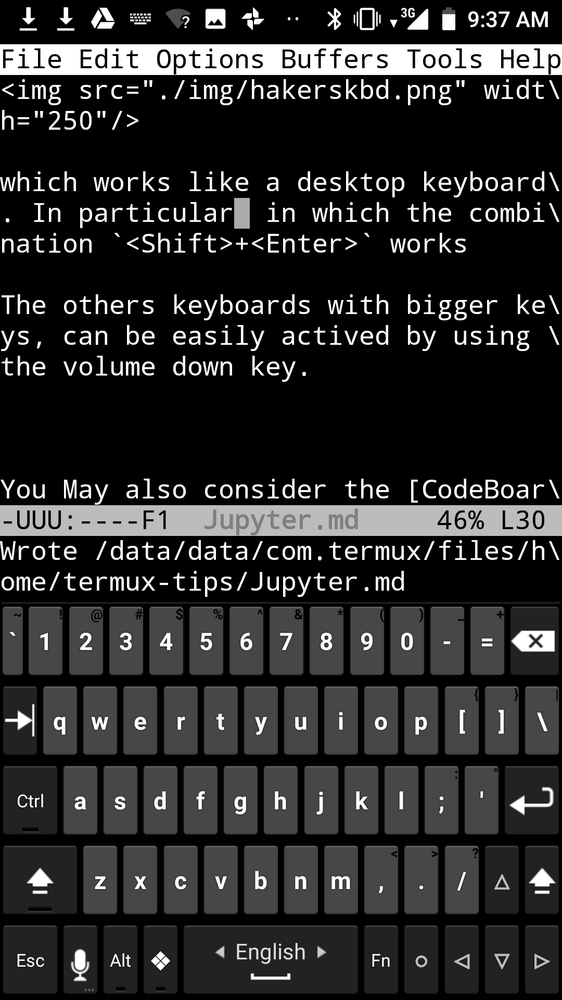
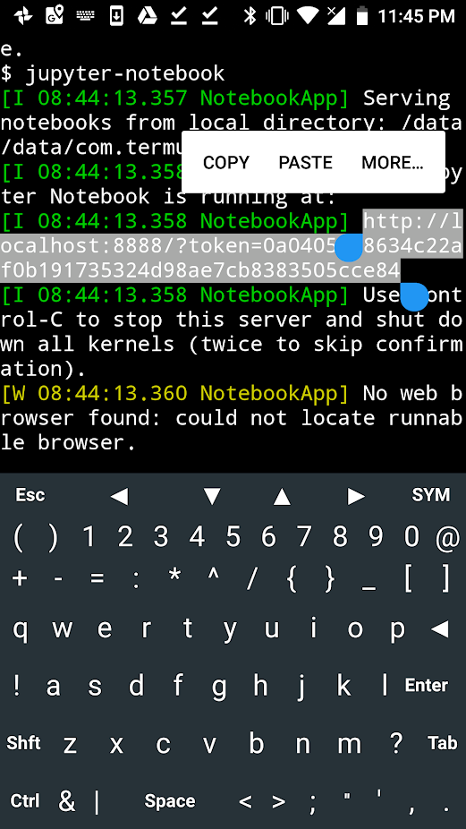
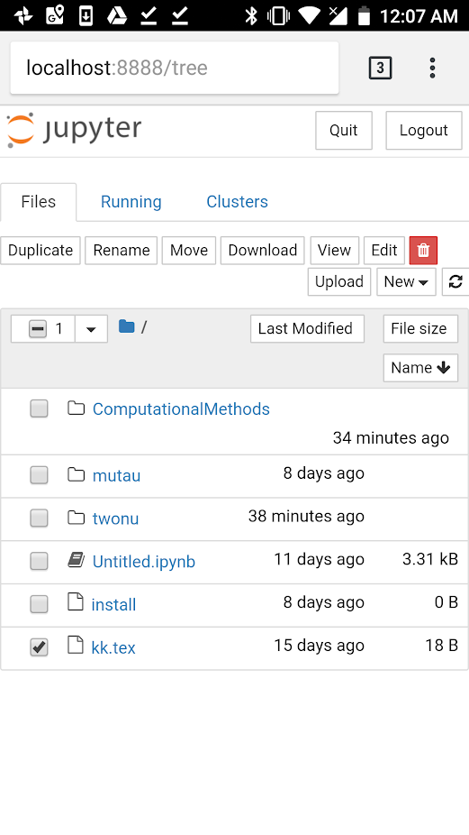
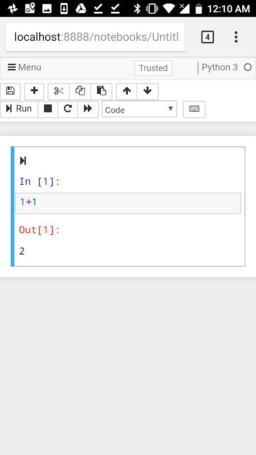

# Jupyter in android
After [install Termux](./termux.md):

## Install Jupyter
From [here](https://gist.github.com/volkbay/46150e9601d3411886c687fc575a4a1b)

```bash
pkg update
pkg install clang python python-pip libzmq binutils build-essential rust patchelf -y

pip install pyzmq #--install-option="--zmq=/usr/lib"
pip install setuptools_rust
```
Check
```bash
>>> python --version
Python 3.11.8
```
Try to install jupyter
```bash
pip install jupyterlab jupyter
```
Try to lauch `jupyter notebook` and check for the path in the error
```
ImportError: dlopen failed: cannot locate symbol "PyExc_ImportError" referenced by "/data/data/com.termux/files/usr/lib/python3.11/site-packages/zmq/backend/cython/_zmq.cpython-311.so".
```
and use it, according to the python version:
```
patchelf --add-needed libpython3.11.so /data/data/com.termux/files/usr/lib/python3.11/site-packages/zmq/backend/cython/_zmq.cpython-311.so
```

## Install python modules
Install addtional repos for Scipy
```bash
curl -LO https://its-pointless.github.io/setup-pointless-repo.sh && bash setup-pointless-repo.sh
```
and Pandas
```bash
pkg i tur-repo
```
Numpy is a requirement
```bash
pkg i python-scipy python-pandas
```


## Install extended keyboard
Use [Hacker's keyboard](https://github.com/klausw/hackerskeyboard). Go to the settings and choose the full 5-row keyboard in portrait mode‘:



which works like a desktop keyboard. In particular,  the combination `<Shift>+<Enter>`.

The others keyboards with bigger keys, can be easily actived by using the volume down key.


You May also consider the [CodeBoard Keyboard for Coding](https://play.google.com/store/apps/details?id=com.gazlaws.codeboard&hl=en).

## Launch jupyter
From the termux execute the command
```bash
jupyter-notebook
```
and copy the URL



* Touching the upper left edge of the screen you have acces to the termux options to open new sessions and toogle to other sessions. 
## Manage your termux "operating system" from jupyter
Paste the URL into Google Chrome. 
*  From there you can  have access to the termux filesystem with delete and upload/download of files, editor, PDF viewer, ,  etc.


* Code cells include an execution button. Working with the toolbar is also convenient.


